<!-- ===== HERO SECTION ===== -->
<h1 align="center">Hi 👋 I'm Ronald Airon S. Torres</h1>
<h3 align="center">💻 Aspiring Software & Web Developer | 🎨 UI/UX Enthusiast</h3>

BSIT Student • EARIST Manila • OJT Applicant

---

# 🧑‍💻 About Me

I am a motivated **BSIT student** seeking an **On-the-Job Training (OJT)** opportunity.

I have foundational knowledge in **software development, web technologies, and UI/UX design**, combined with strong documentation, research, and creative design skills.

✨ Self-driven learner  
✨ Hands-on academic project experience  
✨ Strong work ethic and adaptability  

---

# 🚀 Tech Stack & Tools

<h3 align="center">Frontend • Backend • Tools • Platforms</h3>

---

# 💼 Featured Projects

## 🌱 AgriAssist
<table>
<tr>
<td width="60%">

Agriculture assistant system designed for monitoring and support.

**Tech Used:** Web + UI/UX Design  
**Role:** Developer / Designer  

</td>

<td>
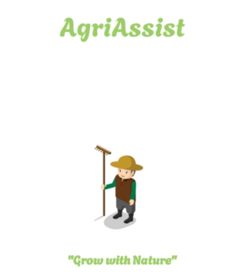
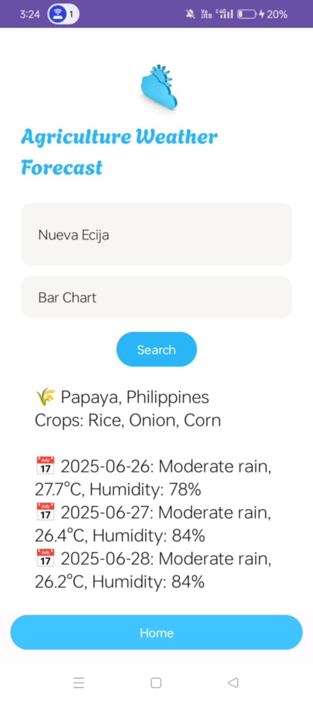
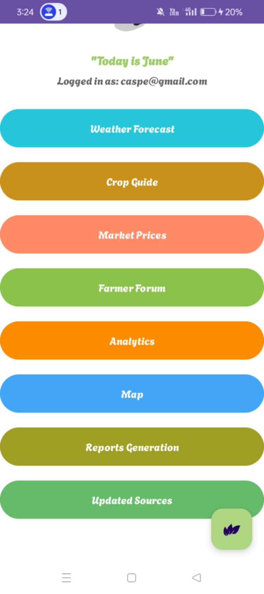
</td>
</tr>
</table>

---

## 🏠 HappyHomes
<table>
<tr>
<td width="60%">

Housing management and listing system.

</td>

<td>
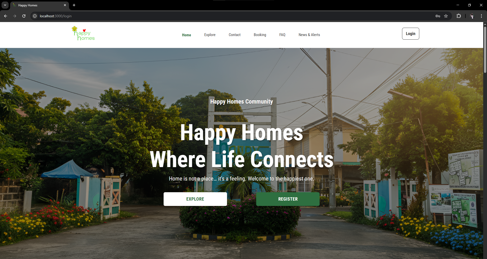

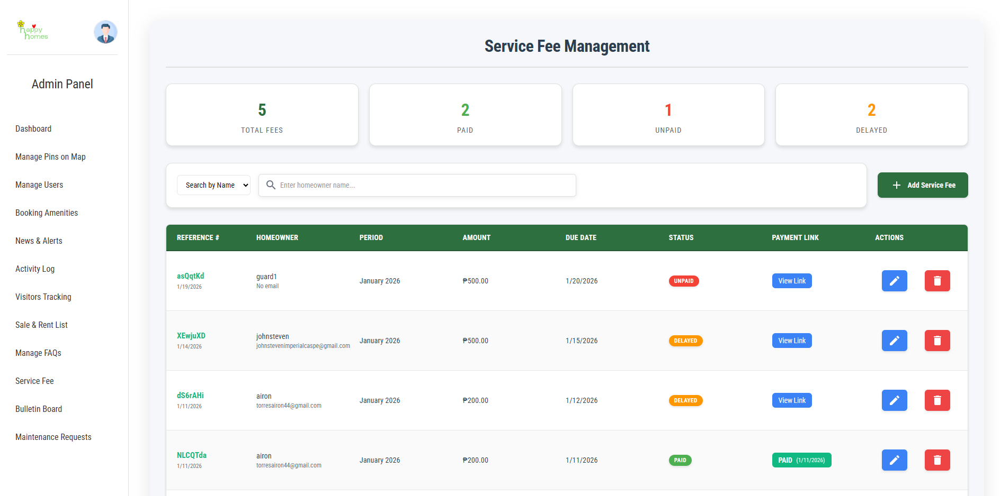
</td>
</tr>
</table>

---

## 🎬 Cinema System
<table>
<tr>
<td width="60%">

Cinema booking and dashboard interface.

</td>

<td>
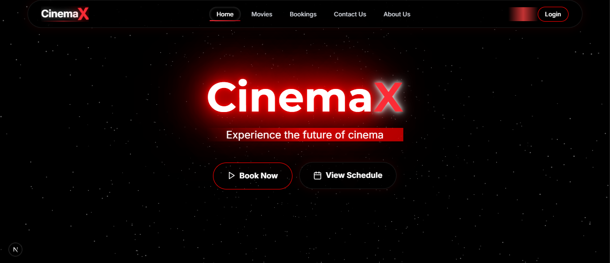
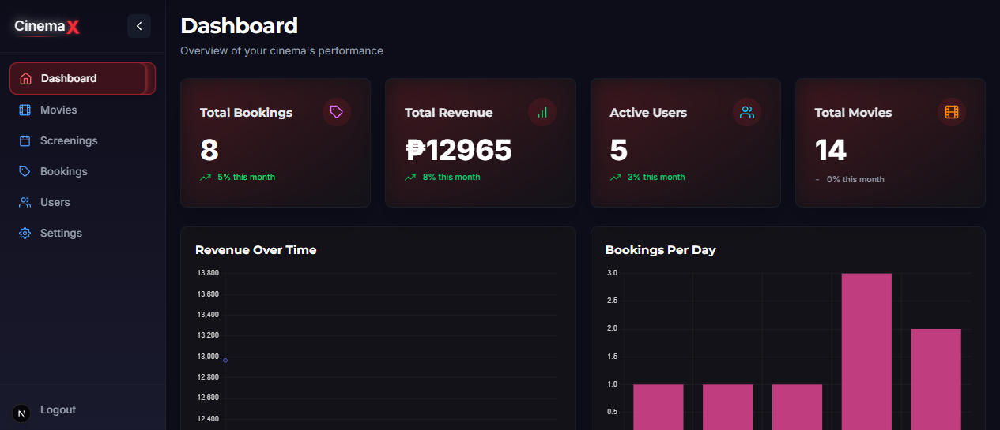
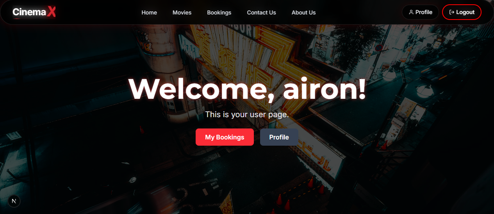
</td>
</tr>
</table>

---

## 🏛 Barangay System
<table>
<tr>
<td width="60%">

Barangay record and service management system.

</td>

<td>
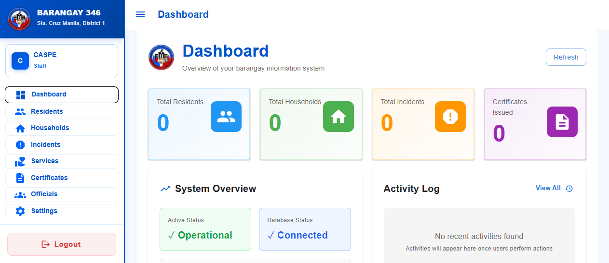
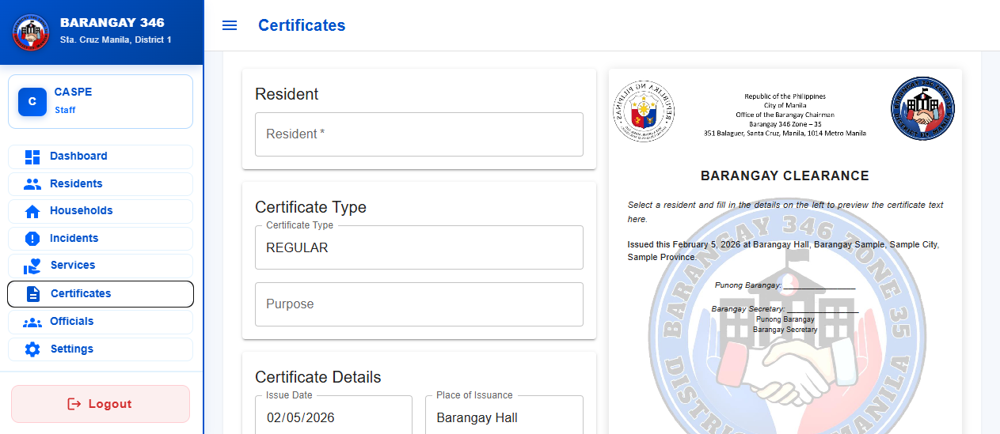
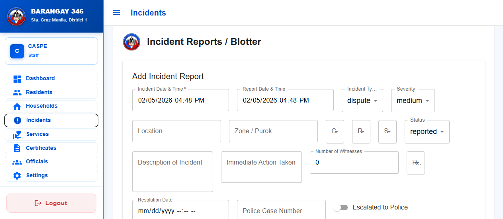
</td>
</tr>
</table>

---

# 🎨 UI/UX Works

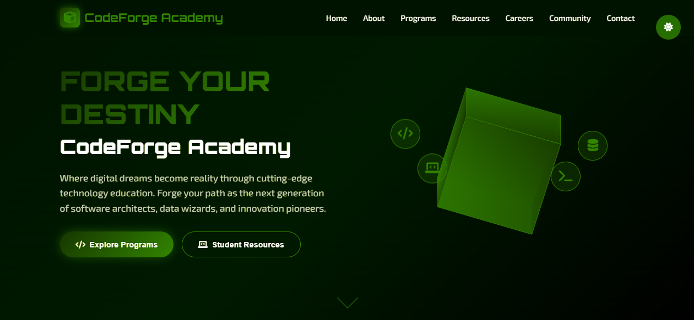
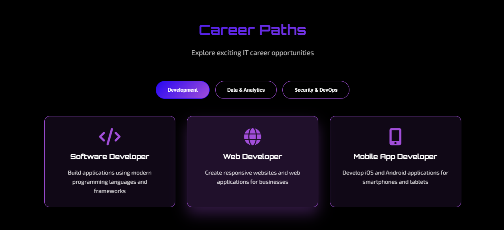
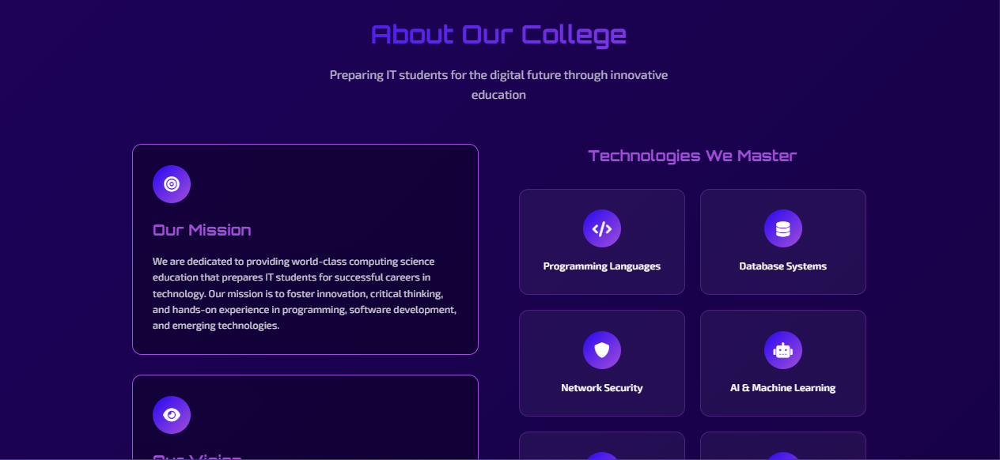

---

# 📜 Certifications

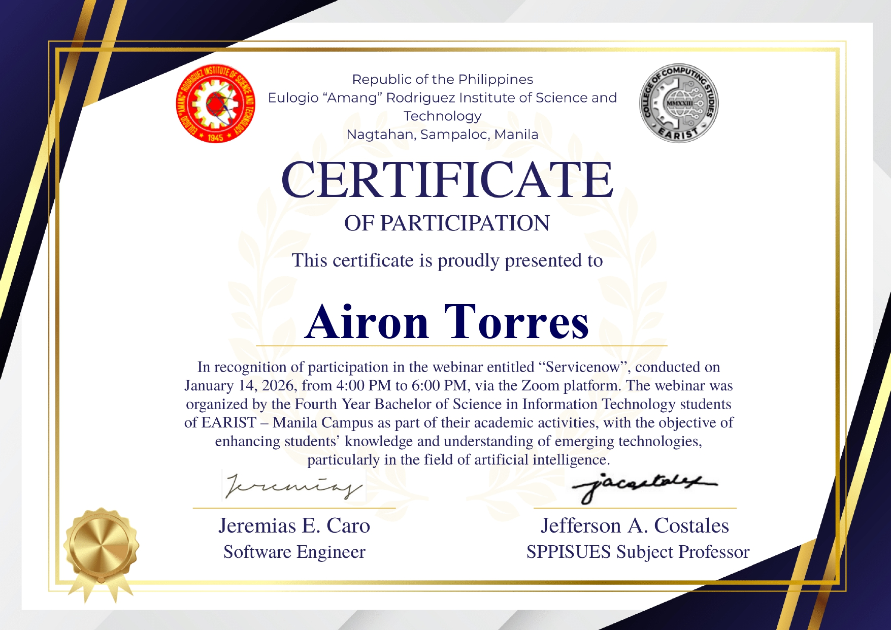
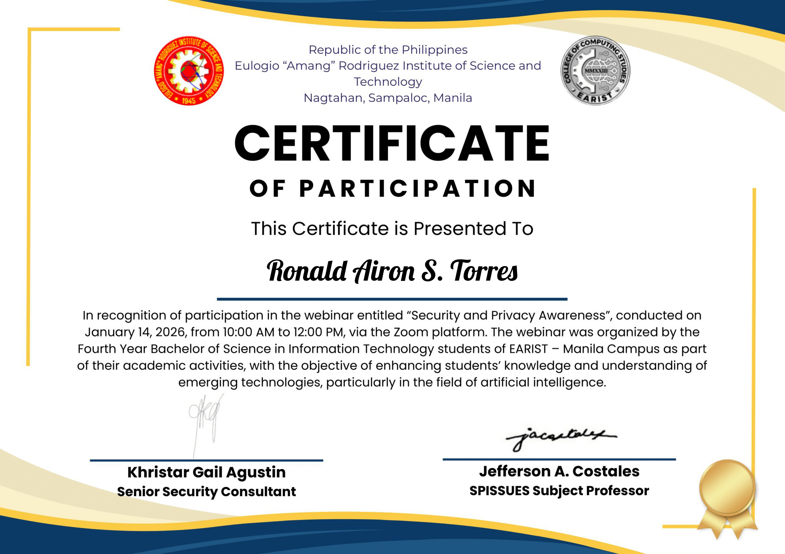
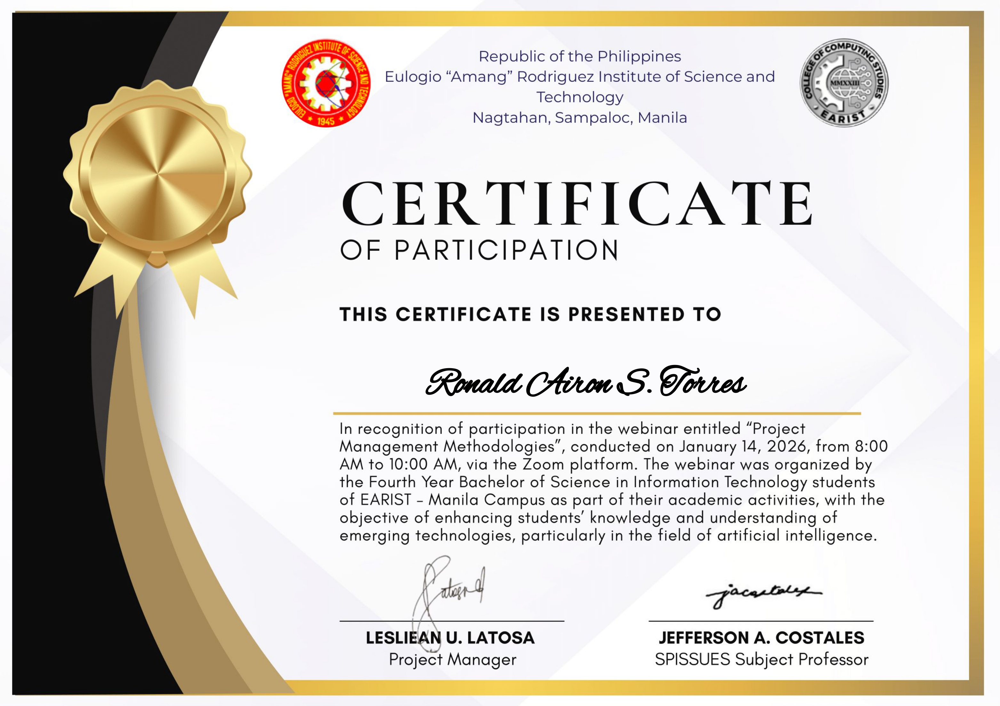
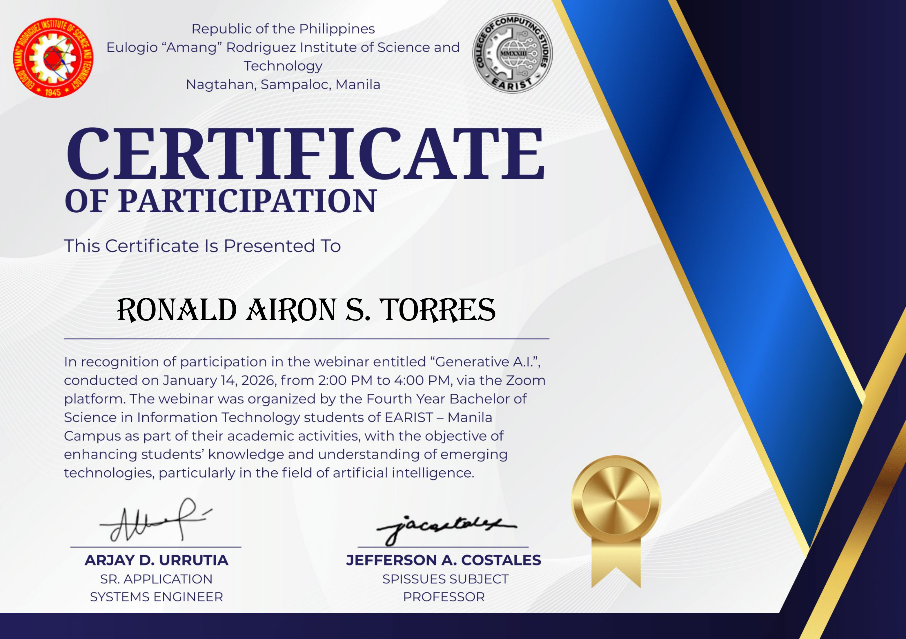

---

# 🏆 Achievements

🥈 2nd Place – UI/UX Design Competition  
🎨 Designed UI and Website Layouts for Academic Projects  
🎬 Created Multimedia & Short Film School Outputs  
📚 Self-studied Programming Beyond Coursework  

---

# 💼 Experience

### 🛒 Small Business Operator
• Managed sales and daily operations  
• Customer handling  
• Business problem solving  

---

# 🎓 Education

**BS Information Technology**  
EARIST Manila (2022 – Present)

Relevant:
- Software Engineering
- Web Development
- Database Management
- UI/UX Design

---

# 🌍 Additional Info

**Languages:** English, Tagalog  
**Strengths:** Fast learner • Adaptable • Detail-oriented  

---

# 📫 Contact

📧 torres.r.bsinfotech@gmail.com  
📍 Tondo, Manila
